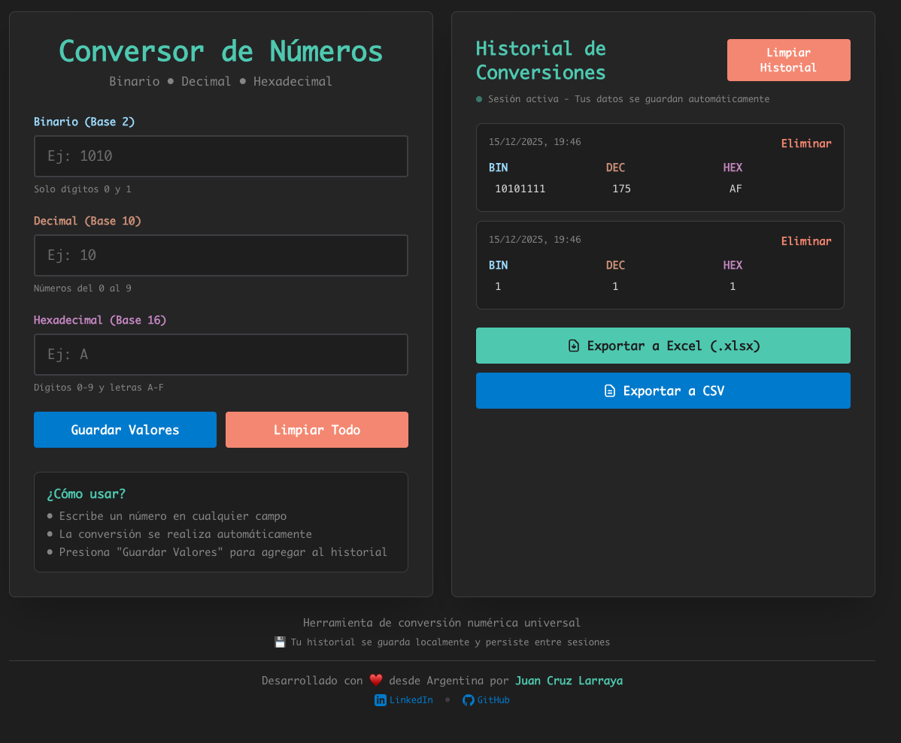

# Conversor de Números Universal

Conversor entre sistemas numéricos: Binario, Decimal y Hexadecimal.



## Características

- Conversión bidireccional entre binario, decimal y hexadecimal
- Actualización en tiempo real
- Interfaz responsive y moderna
- Modo claro/oscuro automático
- Validación de entrada para cada sistema numérico
- Desplegado en Vercel para acceso desde cualquier lugar

## Uso

1. Escribe un número en cualquiera de los tres campos
2. La conversión se realiza automáticamente en los otros dos campos
3. Usa el botón "Limpiar Todo" para reiniciar

## Desarrollo Local

```bash
# Instalar dependencias
npm install

# Ejecutar en modo desarrollo
npm run dev

# Construir para producción
npm run build

# Iniciar servidor de producción
npm start
```

Abre [http://localhost:3000](http://localhost:3000) en tu navegador.

## Deploy en Vercel

Este proyecto está optimizado para desplegarse en Vercel:

1. Sube el código a un repositorio de GitHub
2. Importa el proyecto en Vercel
3. Vercel detectará automáticamente Next.js y configurará el deploy

O usa el CLI de Vercel:

```bash
npm i -g vercel
vercel
```

## Tecnologías

- Next.js 15
- React 19
- TypeScript
- Tailwind CSS
- Vercel

## Validación

- **Binario**: Solo acepta 0 y 1
- **Decimal**: Solo acepta números 0-9
- **Hexadecimal**: Acepta 0-9 y A-F (case-insensitive)
